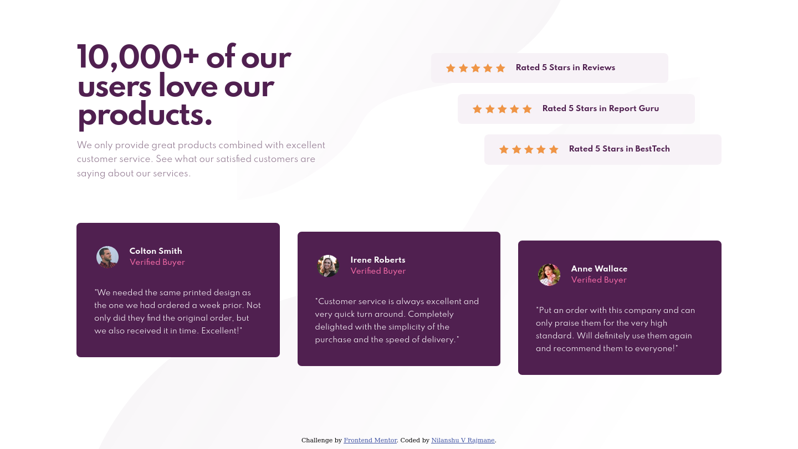
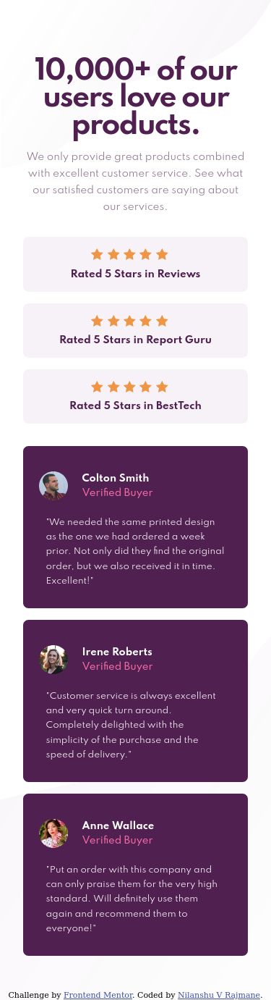

# Frontend Mentor - Social proof section solution

This is a solution to the [Social proof section challenge on Frontend Mentor](https://www.frontendmentor.io/challenges/social-proof-section-6e0qTv_bA). Frontend Mentor challenges help you improve your coding skills by building realistic projects. 

## Table of contents

- [Overview](#overview)
  - [The challenge](#the-challenge)
  - [Screenshot](#screenshot)
  - [Links](#links)
- [My process](#my-process)
  - [Built with](#built-with)
  - [What I learned](#what-i-learned)
  - [Continued development](#continued-development)
- [Author](#author)

## Overview

### The challenge

Users should be able to:

- View the optimal layout for the section depending on their device's screen size

### Screenshot

### Links

- Solution URL: [Github](https://github.com/nilanshu96/social-proof-section)
- Live Site URL: [Live Website](https://nilanshu96.github.io/social-proof-section/)

## My process

### Built with

- Semantic HTML5 markup
- CSS custom properties
- Flexbox
- CSS Grid
- Mobile-first workflow

### What I learned

I learnt how to use `grid-template-areas` and to create slightly complex grid layouts which aren't symmetrical. I also learnt how to use for loop in sass.

### Continued development

I want to keep practicing more complex flex and grid layouts to increase my speed

## Author

- Website - [Nilanshu V Rajmane](https://github.com/nilanshu96)
- Frontend Mentor - [@nilanshu96](https://www.frontendmentor.io/profile/nilanshu96)
- Twitter - [@nilanshu96](https://www.twitter.com/nilanshu96)
